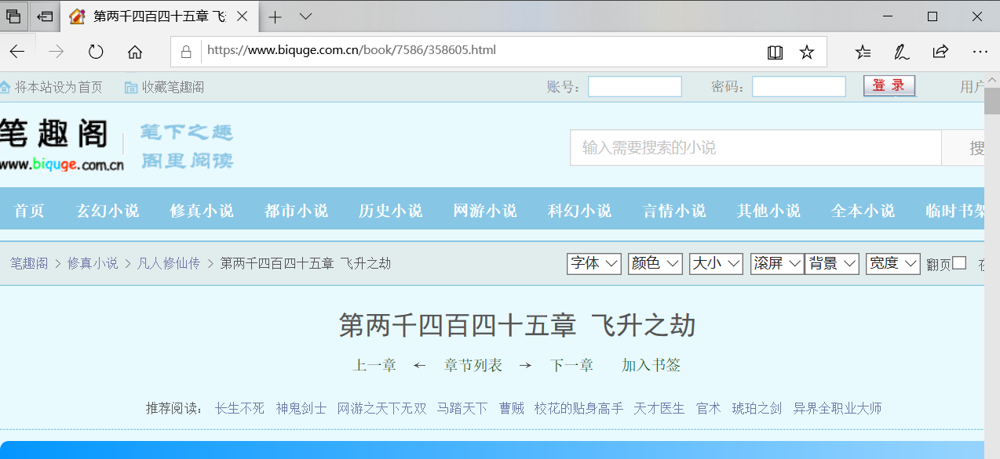
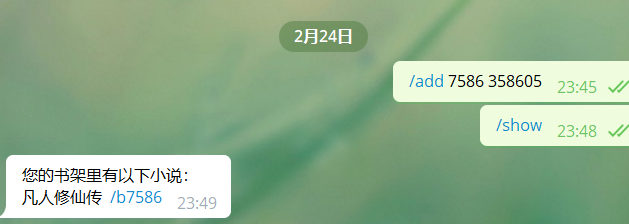
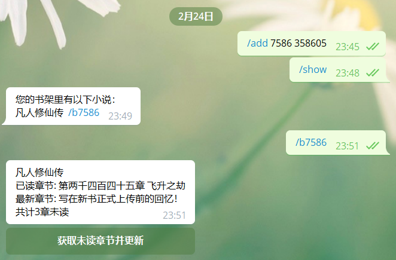
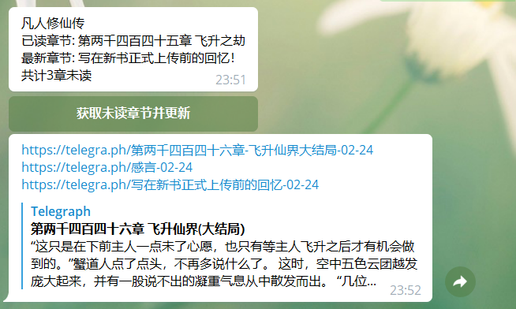
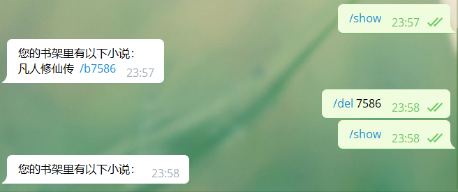

>  novelbot是一个基于python3开发的telegram bot，用于订阅网络小说更新
>
> PS: 本bot通用笔趣阁模板的小说站点，默认是www.biquge.com.cn，可以自行在源码中将其替换为别的笔趣阁模板站点，不影响解析结果。

## 安装

首先安装依赖

```
pip install -r requirements.txt
```

或

```
pip install requests bs4 python-telegram-bot telegraph
```


安装完依赖后打开novelbot.py

```
updater = Updater("<token>") #将<token>替换成自己申请的bot token
```


进入novelbot.py所在目录下输入来运行

``` 
python novelbot.py
```


## 添加小说

当看到小说某一章时

```
https://www.biquge.com.cn/book/7586/358605.html
```



7586是这本小说的代码，358605是章节代码

那么即可输入`/add 7586 358605`保存该小说该章节


## 查看小说

输入`/show`即可查看所有添加的小说



选择想看的小说点击书名后面跟着的`/bxxxx`就会显示详细的小说信息



点击按钮即可获取所有的未读章节，并且更新配置文件，将已读章节修改为最新章节



本bot爬取了章节之后利用telera.ph发布，阅读体验较好（特别是在移动端）


## 删除小说

可以先`/show`看我们添加的小说，以及它的小说代码(`/b`后面的数字)。然后指定其删除

`/del <bookcode>` 



